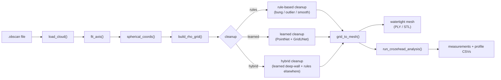
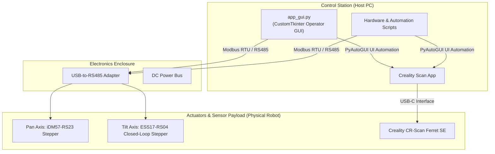

# Dual-Axis Pass-Through Barrel Scanner

## 📋 Project Overview
In the wine and spirits industry, the precise characterization of a barrel's internal geometry is critical. The oak-to-liquid contact ratio directly influences the chemical extraction, flavor profile, and aging velocity of the wine. However, standard cooperage volumes vary due to the natural irregularities of wood bending and hand-shaving processes.

To accurately calculate the internal volume and exact surface area of these wine barrels, this project deploys a high-resolution **Creality CR-Scan Ferret SE 3D scanner** inside the barrel. The machine is dropped onto a standard barrel bung hole (~38mm) and operates using a custom coaxial Pan/Tilt Turret Assembly housed inside a cylindrical tube. This design isolates all sensitive electronics and motors outside or at the rear of the tube, allowing only the scanning payload to enter the barrel.

Initially conceived as a Node-RED project, the control system has been shifted to a **unified, pure Python control stack** to allow for native multi-threading safety, clean version control, and seamless integration between physical motor control (Modbus RTU) and scanner UI automation (PyAutoGUI).

## 🚦 Project Status (as of Aug 20, 2026)

The control software, safety systems, operator GUI, reconstruction pipeline, and evaluation framework are all implemented and individually verified. Running the physical ground-truth protocol against real barrels and populating the frozen validation manifest (currently two placeholder rows) with real measurements is part of future implementation. A full narrative writeup of the system architecture, validation methodology, risks, and future work lives in: "Will have final report linked once complete".

Everything below reflects the codebase as it exists today; see the [Documentation](#-documentation) table for links to every guide in the repo.

## Pipeline Overview

Barrels are reconstructed from `.obscan` point clouds through a spherical height-field representation, cleaned (bung/outlier/crease-aware smoothing), converted to a watertight mesh, and measured.



See [docs/PIPELINE_GUIDE.md](docs/PIPELINE_GUIDE.md) for a full start-to-finish walkthrough (single file and batch), and [docs/LEARNED_CLEANUP_PLAN.md](docs/LEARNED_CLEANUP_PLAN.md) for the plan behind the learned cleanup stage.

**Cleanup status**: rule-based cleanup (`--cleanup rules`, default) is production. Learned (`--cleanup learned`) and hybrid (`--cleanup hybrid`, learned denoising confined to the deep stave wall with rules handling heads/poles/crozehead) are implemented in [`reconstruction/barrel_reconstruct.py`](reconstruction/barrel_reconstruct.py) but **not yet promoted** — see [Machine-Learned Cleanup](#-machine-learned-cleanup-status) below for current numbers.

---

## ⚙️ Mechanical Design: Coaxial Pan/Tilt Turret Assembly
The physical scanner utilizes a compact, coaxial nested design to fit the dual-axis mechanism through the narrow 38mm barrel bung hole:

* **Housing**: Cylindrical tube; all components are mounted inside the tube.
* **Rotation (Pan) Axis**: Driven by a large stepper motor (iDM57-RS23) fixed to a rear bracket inside the tube, aligned with the tube's central axis. Spinning this motor rotates the entire turret assembly around the tube's long axis.
* **Tilt Axis**: Driven by a smaller stepper motor (ESS17-RS04) also mounted at the rear, adjacent to the rotation motor. The tilt motor's shaft is a worm screw that meshes with a large blue worm gear. This blue gear is fixed to a central shaft that runs forward through the center of the assembly to a red bracket at the front, terminating in a second worm screw that tilts the camera mount.
* **Coaxial Nesting**: The tilt shaft (blue gear → front red bracket) shares the centerline of the main rotation shaft. Because the tilt shaft passes through the middle of the rotating assembly, the tilt drivetrain rotates along with the turret during panning. Tilt motion remains independently controlled by the small rear motor, but its shaft physically travels with the pan rotation.

---

## 🛠️ System Architecture



---

## 🖥️ Operator GUI (`app_gui.py`)

`app_gui.py` is a CustomTkinter dashboard that is the primary way to run a scan. It is a state machine (`AppState`: Ready → Scanning → Processing → Results, with a dedicated Error state) with these pieces:

* **Ready / Scanning / Processing / Results / Error frames** — one screen per stage of a scan, with a live timer, progress messages from a background worker thread, and a results panel that logs volume/area/watertightness to CSV (`save_results_to_log`).
* **`TiltProtractorWidget`** — an interactive circular dial for setting the tilt angle of each pass in degrees, which is converted to/from raw tilt encoder pulses via `deg_to_encoder()` / `encoder_to_deg()` (calibrated range: **−158° to +90°**, mapping to **−8200 to +7700 encoder pulses**).
* **Technician / settings frame** — jog controls for both axes, live connection polling, manual "run reconstruction on an existing file" trigger, and editable motor/sweep/reconstruction settings backed by `config_manager.py`.
* **Safety** — emergency stop and a controlled-stop path (`handle_emergency_stop`, `handle_controlled_stop`), plus a watchdog fault callback that reacts to position-error alarms from the tilt drive.

Configuration is persisted to [`scan_config.json`](scan_config.json) via [`config_manager.py`](config_manager.py), which merges saved values over sane defaults, keeps `rot_deg`/`rot_revs` in sync, and validates the reconstruction `cleanup_mode` against `("rules", "learned", "hybrid")`, falling back to `"rules"` if the file has an unrecognized value.

---

## 🔬 Machine-Learned Cleanup: Status

The learned cleanup path (PointNet point pre-filter + GridUNet grid denoiser, see [docs/LEARNED_CLEANUP_PLAN.md](docs/LEARNED_CLEANUP_PLAN.md)) is implemented and checkpointed (`models/point_classifier_best.pt`, `models/grid_denoiser_best.pt`, plus a newer candidate `models/grid_denoiser_v2_sparsity.pt`), but **has not cleared the promotion bar** defined in [docs/PROMOTION_RULE.md](docs/PROMOTION_RULE.md). Latest synthetic validation (`notebooks/05_rules_vs_learned_volume_accuracy.ipynb`, raw data in `data/synthetic_validation/synthetic_validation_results.csv`, 16 synthetic barrels per method):

| Cleanup mode | Mean abs. volume error | Max abs. volume error | Watertight rate |
| :--- | :--- | :--- | :--- |
| `rules` (production default) | **4.03%** | 4.58% | 100% |
| `learned` | 30.91% | 31.84% | 100% |
| `hybrid` | 4.51% | 5.63% | 100% |
| `learned` (v2 checkpoint) | 22.80% | 24.18% | 100% |
| `hybrid` (v2 checkpoint) | **3.85%** | 4.33% | 100% |

`hybrid` with the newer `grid_denoiser_v2_sparsity.pt` checkpoint is the closest any learned variant has come to the rules baseline — and is nominally *slightly* better on mean error — but the improvement (≈0.18 percentage points) is well under the ≥0.5-point margin `docs/PROMOTION_RULE.md` requires for promotion, so **`rules` remains the production default and no learned/hybrid checkpoint is currently promoted.** These numbers are also purely synthetic (`barrel_synth.py`-generated barrels); they are not yet corroborated against physically ground-truthed real barrels — see the next section.

---

## 📏 Validation & Ground Truth

* [docs/GROUND_TRUTH_PROTOCOL.md](docs/GROUND_TRUTH_PROTOCOL.md) — how physical ground-truth volume/geometry is measured (mass-based water-fill, caliper + analytic frustum model, or nominal cooperage spec, in order of preference).
* [docs/PROMOTION_RULE.md](docs/PROMOTION_RULE.md) — the quantitative gate (accuracy, outlier, watertightness, held-out criteria) a learned checkpoint must clear before it can replace `rules` as the default.
* [`data/validation_set/README.md`](data/validation_set/README.md) — the frozen, versioned validation dataset structure and rules. **Current state: only 2 placeholder/sample rows in `validation_manifest.csv`** (`B001_SAMPLE`, `B002_SAMPLE`) — populating this with real, physically ground-truthed barrels is the top-priority remaining task.
* [`reconstruction/check_regression.py`](reconstruction/check_regression.py) — automated regression gate intended to run in CI before merging any change to model architecture or reconstruction logic.

---

## 📅 8-Week Master Timeline & Milestones (Pure Python Stack)

| Phase / Week | Objectives | Key Tasks | Status |
| :--- | :--- | :--- | :--- |
| **Weeks 1–2** | Mechanical Design Review & Bench Setup | Review concept sketches and Fusion 360 models; verify initial motion translation parameters; verify Python serial comms and PyAutoGUI environment | ✅ Complete |
| **Weeks 3–4** | Python GUI & Motor Test Interface | Single-motor jog functions; Modbus register-level control (`ess17_control.py`, `scan_sequence.py`); `app_gui.py` with sliders, position readbacks, emergency stop | ✅ Complete |
| **Weeks 5–6** | Integration & Kinematic Calibration | Confirm as-built mechanical parameters; calibrate steps-per-degree (tilt: −158°..+90° ↔ −8200..+7700 pulses); verify motion ranges | ✅ Complete  |
| **Weeks 7–8** | Creality Software Bridge & Safety Watchdog | Integrate `creality_autostart.py` into the GUI loop; background safety watchdog polling tilt position error; end-to-end trials on experimental barrels | ✅ Complete |

---

## 📂 Codebase Structure

```
Dual-Axis-Pass-Through-Barrel-Scanner/
│
├── app_gui.py                  # CustomTkinter operator dashboard (primary entry point)
├── config_manager.py           # Loads/saves scan_config.json, validates cleanup_mode
├── scan_config.json            # Motor, sweep, and reconstruction settings (user-editable)
├── ess17_control.py            # Standalone ESS17-RS04 (tilt) bounds-sweep CLI utility
├── scan_sequence.py            # ESS17/iDM57 dual-axis scan-sequence CLI (used by the GUI)
├── debug_template_test.py      # Screenshot + template-match debug helper -> debug/
│
├── hardware/                   # Hardware control & PyAutoGUI automation scripts
│   ├── creality_autostart.py       # Creality Scan UI automation (Preview→Start→Stop→Export)
│   ├── run_precision_scan.py       # Encoder-verified precision pan sweep + scan automation
│   ├── simultaneous_dual_axis_move.py  # Concurrent pan+tilt move CLI with safety bounds
│   ├── test_camera_bounds.py       # Interactive tilt travel-limit discovery tool
│   ├── idm57_rs23_modbus_check.py  # iDM57 Modbus connectivity smoke test
│   ├── idm57_rs23_move_one_rev.py  # iDM57 single-revolution move test
│   ├── ess17_rs04_move_one_rev.py  # ESS17 single-revolution move test
│   ├── ess17_rs04_rotate_10_revs.py# ESS17 10-revolution stress test
│   ├── waveshare_pwm_led_demo.py       # Waveshare PWM module LED brightness demo
│   └── waveshare_pwm_relay_toggle_demo.py  # Same, adapted for relay ON/OFF switching
│
├── reconstruction/              # Core 3D reconstruction & volume pipeline
│   ├── barrel_reconstruct.py       # Primary entry point (spherical map, cleanup, volume)
│   ├── barrel_batch.py             # Batch STL analysis / fleet-scale summary CSVs
│   ├── barrel_features.py          # Curvature / crease feature extraction
│   ├── barrel_denoise_grid.py      # Learned GridUNet grid denoiser
│   ├── barrel_denoise_points.py    # Learned PointNet point classifier
│   ├── barrel_synth.py             # Synthetic barrel data generator
│   ├── barrel_eval.py              # Metrics evaluation harness
│   ├── train_grid_denoiser.py      # GridUNet training script
│   ├── train_point_classifier.py   # PointNet training script
│   ├── validate_accuracy.py        # Accuracy validation CLI
│   ├── validate_stats.py           # Validation dataset statistics
│   └── check_regression.py         # CI regression gate vs. baseline_summary.csv
│
├── notebooks/                   # Interactive ML workflows & visualizations
│   ├── 01_synthetic_data.ipynb
│   ├── 02_train_grid_denoiser.ipynb
│   ├── 03_train_point_classifier.ipynb
│   ├── 04_evaluate_models.ipynb
│   └── 05_rules_vs_learned_volume_accuracy.ipynb  # rules vs learned vs hybrid comparison
│
├── models/                      # PyTorch model checkpoints (gitignored, see .gitignore)
│   ├── grid_denoiser_best.pt
│   ├── grid_denoiser_v2_sparsity.pt
│   ├── point_classifier_best.pt
│   └── synthetic_barrel_42.npz
│
├── data/
│   ├── validation_set/              # Frozen physical ground-truth validation dataset
│   │   ├── README.md
│   │   ├── validation_manifest.csv
│   │   └── scans/                       # Raw .obscan files (gitignored)
│   └── synthetic_validation/
│       └── synthetic_validation_results.csv  # Rules/learned/hybrid synthetic comparison
│
├── docs/                        # All documentation & guides (see table below)
├── templates/                   # PyAutoGUI template crops (root + per-resolution folders)
├── tests/                       # Unit tests
│   └── test_config_manager.py
├── debug/                       # Debug screenshots from debug_template_test.py (gitignored)
├── saved_creality_files/        # Default export destination for scanned .obscan files
├── scan_config.json             # (see above)
└── README.md                    # This file
```

---

## 📚 Documentation

Every other doc in this repo, in one place:

| Doc | Covers |
| :--- | :--- |
| [docs/PIPELINE_GUIDE.md](docs/PIPELINE_GUIDE.md) | Step-by-step walkthrough of `barrel_reconstruct.py` and `barrel_batch.py`, output file structure, troubleshooting |
| [docs/LEARNED_CLEANUP_PLAN.md](docs/LEARNED_CLEANUP_PLAN.md) | Phased roadmap for the learned/hybrid cleanup path and current phase status |
| [docs/PROMOTION_RULE.md](docs/PROMOTION_RULE.md) | Quantitative criteria + CI gate a learned checkpoint must clear to become the default |
| [docs/GROUND_TRUTH_PROTOCOL.md](docs/GROUND_TRUTH_PROTOCOL.md) | How physical ground-truth volume/geometry measurements are taken |
| [docs/TEMPLATE_SETUP.md](docs/TEMPLATE_SETUP.md) | How to capture PyAutoGUI button/banner templates for `hardware/creality_autostart.py`, multi-resolution setup |
| [docs/Barrel_Scanner_Final_Report.docx](docs/Barrel_Scanner_Final_Report.docx) | Full engineering & research report: architecture, validation methodology, risks, future work |
| [data/validation_set/README.md](data/validation_set/README.md) | Frozen validation dataset structure and rules for adding barrels |

---

## ⚙️ Configuration & Calibration Parameters

These motion parameters (see [`scan_config.json`](scan_config.json) / [`config_manager.py`](config_manager.py)) tell the control software how motor steps translate into physical scanner motion:

### 1. Pan / Rotation Axis (iDM57-RS23 Stepper)
* **Slave ID (Modbus)**: `1`
* **Pulses per revolution**: `10000` (`rot_pulses_per_rev` in `scan_config.json`)
* **Drive Mechanism**: Coaxial direct/geared rotation of entire turret assembly
* **Motion**: Continuous, multi-revolution rotation — no hard mechanical stop. Default sweep is `rot_revs: 4.0` (1440°); `rot_deg` and `rot_revs` are kept in sync by `config_manager.py`.

### 2. Tilt Axis (ESS17-RS04 Closed-Loop Stepper)
* **Slave ID (Modbus)**: `2`
* **Pulses per revolution**: `1000` (`tilt_pulses_per_rev` in `scan_config.json`)
* **Drive Mechanism**: Coaxial central shaft driven by rear worm gear, terminating in a front worm screw.
* **Calibrated travel range**: **−158° to +90°**, mapped to encoder pulses **−8200 to +7700** (see `deg_to_encoder`/`encoder_to_deg` in `app_gui.py`). An internal safety check monitors the position-error register to cut torque if mechanical binding occurs.
* **Kinematic cross-coupling**: designed for but, per the note in the timeline above, not yet implemented in the current controller code.

### 3. Reconstruction
* **Cleanup mode**: `reconstruction_settings.cleanup_mode` in `scan_config.json` — one of `rules` (default/production), `learned`, or `hybrid`. See [Machine-Learned Cleanup: Status](#-machine-learned-cleanup-status).

---

## 🚀 Setup & Installation

### Hardware Connection
1. Connect the USB-to-RS485 adapter to your Windows computer.
2. Wire the RS485 `A+` and `B-` terminals to the respective lines on the iDM57-RS23 and ESS17-RS04 stepper drivers.
3. Supply 24-48V DC power to the drivers. Ensure the ground wires are tied together.
4. Set the DIP switches on the drivers for `115200` baud rate and set the corresponding Modbus slave addresses (ID 1 for Pan, ID 2 for Tilt).

### Python Environment
Ensure Python 3.9+ is installed, then install the required dependencies:
```bash
# Core control + GUI + UI automation
pip install pymodbus pyautogui opencv-python pygetwindow pillow customtkinter pyperclip

# Reconstruction pipeline
pip install numpy scipy trimesh

# Learned cleanup path (optional)
pip install torch scikit-learn

# hardware/test_camera_bounds.py only
pip install keyboard
```

### Template Customization
Before running the UI automation script:
1. Open the Creality Scan software on your main display.
2. Follow the steps in [docs/TEMPLATE_SETUP.md](docs/TEMPLATE_SETUP.md) to capture custom template images for the Preview button, ready text banner, and Start button.
3. Save the cropped PNGs into the `templates/` folder (or a resolution-named subfolder, e.g. `templates/1920x1080/`).

### Running It
* **Full operator workflow**: `python app_gui.py`
* **Reconstruction only**: `python reconstruction/barrel_reconstruct.py "C:/path/to/scan.obscan"` (see [docs/PIPELINE_GUIDE.md](docs/PIPELINE_GUIDE.md))
* **Scan sequence only (headless)**: `python scan_sequence.py --config scan_config.json`
* **Unit tests**: `python tests/test_config_manager.py`

---

## 🗂️ Where Things Live (quick reference)

* **Runtime scan exports** land in `saved_creality_files/` (gitignored).
* **Debug screenshots** from `debug_template_test.py` land in `debug/` (gitignored going forward).
* **Model checkpoints** live in `models/` and are gitignored (`*.pt`) — regenerate via the training notebooks/scripts or fetch separately.
* **Per-scan results log** is written by `app_gui.py`'s `save_results_to_log()`.
