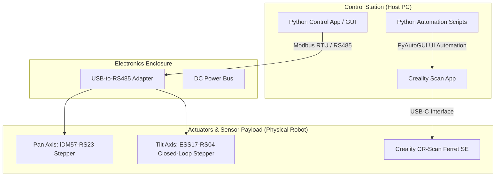

# Dual-Axis Pass-Through Barrel Scanner

## 📋 Project Overview
In the wine and spirits industry, the precise characterization of a barrel's internal geometry is critical. The oak-to-liquid contact ratio directly influences the chemical extraction, flavor profile, and aging velocity of the wine. However, standard cooperage volumes vary due to the natural irregularities of wood bending and hand-shaving processes.

To accurately calculate the internal volume and exact surface area of these wine barrels, this project deploys a high-resolution **Creality CR-Scan Ferret SE 3D scanner** inside the barrel. The machine is dropped onto a standard barrel bung hole (~38mm) and operates using a custom coaxial Pan/Tilt Turret Assembly housed inside a cylindrical tube. This design isolates all sensitive electronics and motors outside or at the rear of the tube, allowing only the scanning payload to enter the barrel.

Initially conceived as a Node-RED project, the control system has been shifted to a **unified, pure Python control stack** to allow for native multi-threading safety, clean version control, and seamless integration between physical motor control (Modbus RTU) and scanner UI automation (PyAutoGUI).

---

## ⚙️ Mechanical Design: Coaxial Pan/Tilt Turret Assembly
The physical scanner utilizes a compact, coaxial nested design to fit the dual-axis mechanism through the narrow 38mm barrel bung hole:

* **Housing**: Cylindrical tube; all components are mounted inside the tube.
* **Rotation (Pan) Axis**: Driven by a large stepper motor (iDM57-RS23) fixed to a rear bracket inside the tube, aligned with the tube's central axis. Spinning this motor rotates the entire turret assembly around the tube's long axis.
* **Tilt Axis**: Driven by a smaller stepper motor (ESS17-RS04) also mounted at the rear, adjacent to the rotation motor. The tilt motor's shaft is a worm screw that meshes with a large blue worm gear. This blue gear is fixed to a central shaft that runs forward through the center of the assembly to a red bracket at the front, terminating in a second worm screw that tilts the camera mount.
* **Coaxial Nesting**: The tilt shaft (blue gear → front red bracket) shares the centerline of the main rotation shaft. Because the tilt shaft passes through the middle of the rotating assembly, the tilt drivetrain rotates along with the turret during panning. Tilt motion remains independently controlled by the small rear motor, but its shaft physically travels with the pan rotation.

---

## 🛠️ System Architecture



---

## 📅 Proposed 8-Week Master Timeline & Milestones (Pure Python Stack)

| Phase / Week | Objectives | Key Tasks | Milestones |
| :--- | :--- | :--- | :--- |
| **Weeks 1–2** | Mechanical Design Review & Bench Setup | <ul><li>Review concept sketches and Fusion 360 models</li><li>Verify initial motion translation parameters (pan gear ratio, tilt steps-per-degree)</li><li>Verify python serial communications and PyAutoGUI environment</li><li>*Current Status: Completed*</li></ul> | All calibration parameters documented; Python development environment verified. |
| **Weeks 3–4** | Python GUI & Motor Test Interface | <ul><li>Provide single-motor Python jog functions to unblock Reina's bring-up check</li><li>Write unified `DualAxisController` class utilizing `pymodbus`</li><li>Develop `app_gui.py` using `customtkinter` with sliders, position readbacks, and emergency stop</li></ul> | Both motors responding correctly to Modbus commands from Python GUI. |
| **Weeks 5–6** | Integration & Kinematic Calibration | <ul><li>Take delivery of the fabricated hardware from Beringer's machine shop</li><li>Confirm as-built mechanical parameters (worm gear ratios, coaxial alignment)</li><li>Program steps-per-degree calibration into the Python controller</li><li>Implement kinematic cross-coupling compensation between Pan and Tilt axes</li><li>Verify pan (±180°) and tilt (±90°) motion ranges</li></ul> | Coordinated, precise position control matching software target coordinates to physical positions. |
| **Weeks 7–8** | Creality Software Bridge & Safety Watchdog | <ul><li>Integrate `creality_autostart.py` automation sequence into the GUI loop</li><li>Implement background safety thread (`SafetyWatchdog`) to poll ESS17-RS04 position error registers and cut torque on jam</li><li>Run end-to-end trials on experimental barrels</li></ul> | **August 21st:** Final delivery of fully operational, dual-axis automated scanner in Python. |

---

## 📂 Codebase Structure & Architecture

A unified Python stack allows for a modular, clean package design:

```
Dual-Axis-Pass-Through-Barrel-Scanner/
│
├── core/
│   ├── __init__.py
│   ├── motor_controller.py       # Manages Modbus RTU serial comms (Pan & Tilt)
│   ├── ui_automation.py          # Refactored creality_autostart.py logic
│   └── safety_watchdog.py        # Background thread monitoring position errors
│
├── templates/                    # CV Template crops for PyAutoGUI
│   ├── preview_button.png
│   ├── start_button.png
│   └── ready_text.png
│
├── app_gui.py                    # Modern CustomTkinter Dashboard UI
├── idm57_rs23_modbus_check.py    # Initial diagnostics check tool
├── idm57_rs23_move_one_rev.py    # Initial motion proof-of-concept
└── README.md
```

### Reference Implementation Blocks

#### 1. Modbus Control Core (`core/motor_controller.py`)
Encapsulates communication logic for the Pan (iDM57-RS23, Slave ID 1) and Tilt (ESS17-RS04, Slave ID 2) drives:
```python
import logging
from pymodbus.client import ModbusSerialClient
from pymodbus.exceptions import ModbusException

log = logging.getLogger("scanner_hardware")

class DualAxisController:
    def __init__(self, port="COM3", baudrate=115200):
        self.client = ModbusSerialClient(
            port=port, baudrate=baudrate, parity="N", stopbits=1, bytesize=8, timeout=1
        )
        self.pan_id = 1
        self.tilt_id = 2

    def connect(self) -> bool:
        return self.client.connect()

    def disconnect(self):
        self.client.close()

    def read_register(self, slave_id: int, address: int) -> int:
        result = self.client.read_holding_registers(address=address, count=1, slave=slave_id)
        if result.isError():
            raise ModbusException(f"Read error on slave {slave_id} at {address}")
        return result.registers[0]

    def write_register(self, slave_id: int, address: int, value: int):
        result = self.client.write_register(address=address, value=value, slave=slave_id)
        if result.isError():
            raise ModbusException(f"Write error on slave {slave_id} at {address}")

    def jog_pan(self, steps: int, speed_rpm: int):
        self.write_register(self.pan_id, 0x6200, 0x0041)  # Relative move mode
        pos_h = (steps >> 16) & 0xFFFF
        pos_l = steps & 0xFFFF
        self.client.write_registers(address=0x6201, values=[pos_h, pos_l, speed_rpm], slave=self.pan_id)
        self.write_register(self.pan_id, 0x6207, 0x0010)  # Trigger motion

    def stop_all(self):
        """Emergency software halt: clear pulse commands / disable drivers."""
        log.warning("EMERGENCY STOP TRIGGERED")
        self.write_register(self.pan_id, 0x6207, 0x0000)
        self.write_register(self.tilt_id, 0x6207, 0x0000)
```

#### 2. Background Safety Watchdog (`core/safety_watchdog.py`)
Runs in a background thread to continuously poll for collision/jam detection:
```python
import time
import threading

class SafetyWatchdog(threading.Thread):
    def __init__(self, controller: DualAxisController, max_allowable_error=100):
        super().__init__()
        self.controller = controller
        self.max_error = max_allowable_error
        self.running = False

    def run(self):
        self.running = True
        while self.running:
            try:
                # Poll ESS17-RS04 Closed-loop position error register
                position_error = self.controller.read_register(self.controller.tilt_id, 0x1005)
                if abs(position_error) > self.max_error:
                    self.controller.stop_all()
                    print(f"Watchdog alarm: Position error {position_error} exceeded limits!")
                    break
            except Exception as e:
                print(f"Safety watchdog read failed: {e}")
            time.sleep(0.1)

    def stop(self):
        self.running = False
```

---

## ⚙️ Configuration & Calibration Parameters

These motion parameters tell the control software how motor steps translate into physical scanner motion:

### 1. Pan Axis (iDM57-RS23 Stepper)
* **Slave ID (Modbus)**: `1`
* **Microstepping (default)**: `1600 steps/rev`
* **Drive Mechanism**: Coaxial direct/geared rotation of entire turret assembly
* **Calibration constant**: Steps per full revolution based on internal motor step angle and any primary stage reduction
* **Travel limits**: ±180°

### 2. Tilt Axis (ESS17-RS04 Closed-Loop Stepper)
* **Slave ID (Modbus)**: `2`
* **Drive Mechanism**: Coaxial central shaft driven by rear worm gear, terminating in a front worm screw.
* **Calibration constant**: Steps-per-degree conversion derived from the double-stage worm reduction (rear worm gear ratio $\times$ front camera-bracket worm ratio).
* **Kinematic Cross-Coupling**: Since the tilt shaft is nested within the rotating pan assembly, rotating the pan axis while keeping the stationary tilt motor locked will cause the tilt shaft to roll along the tilt motor's worm screw. The software controller must implement a mixing equation to compensate:
  $$\Delta \text{Steps}_{\text{Tilt}} = \text{Steps}_{\text{Target Tilt}} + k \cdot \Delta \text{Steps}_{\text{Pan}}$$
  *(where $k$ is the coupling coefficient determined by the gear ratios).*
* **Travel limits**: ±90° (internal safety check monitors the position error register to cut torque if mechanical binding occurs)

---

## 🚀 Setup & Installation

### Hardware Connection
1. Connect the USB-to-RS485 adapter to your Windows computer.
2. Wire the RS485 `A+` and `B-` terminals to the respective lines on the iDM57-RS23 and ESS17-RS04 stepper drivers.
3. Supply 24-48V DC power to the drivers. Ensure the ground wires are tied together.
4. Set the DIP switches on the drivers for `115200` baud rate and set the corresponding Modbus slave addresses (ID 1 for Pan, ID 2 for Tilt).

### Python Environment
Ensure Python 3.8+ is installed, then install the required dependencies:
```bash
pip install pymodbus pyautogui opencv-python pygetwindow pillow customtkinter
```

### Template Customization
Before running the UI automation script:
1. Open the Creality Scan software on your main display.
2. Follow the steps in `TEMPLATE_SETUP.md` to capture custom template images for the Preview button, ready text banner, and Start button.
3. Save the cropped PNGs into the `templates/` folder.