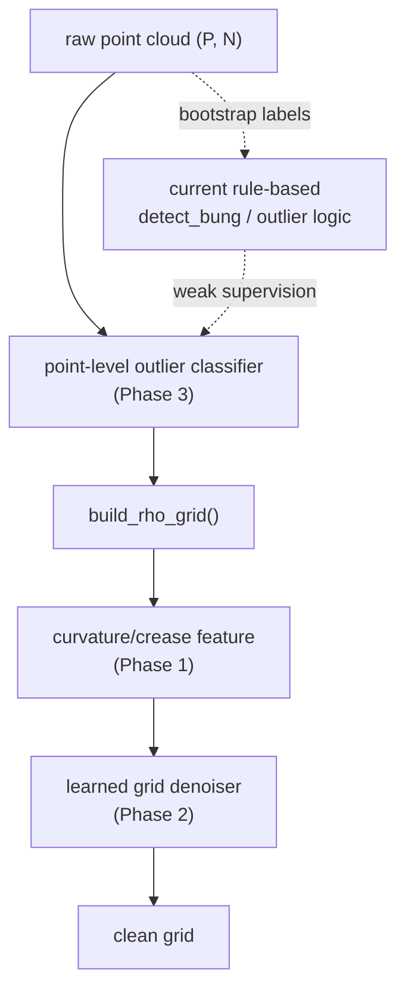
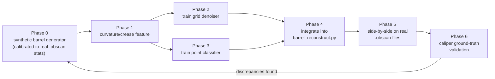

# Learned cleanup plan

This document captures the phased plan for replacing the current rule-based cleanup pass with a learned model. The implementation work is tracked through the training, denoising, and evaluation scripts in this repository, and the user-facing workflow is described in [docs/PIPELINE_GUIDE.md](docs/PIPELINE_GUIDE.md).

## Proposed learned cleanup flow

## Training and validation loop

## Phase summary

- Phase 0: generate synthetic barrels with realistic bung, floater, and head-drop artifacts.
- Phase 1: derive curvature/crease features that are more faithful than hard-coded corner thresholds.
- Phase 2: train a grid-domain denoiser to repair missing and corrupted cells in the rho grid.
- Phase 3: train a point-level classifier to pre-filter outliers before binning.
- Phase 4: integrate the learned path into the reconstruction CLI under the `--cleanup learned` mode.
- Phase 5: run rules vs. learned on real scans and compare reconstruction metrics.
- Phase 6: validate the learned path against caliper ground truth when available.

## Current status

The repository already contains the core pieces for the learned path:

- [barrel_synth.py](barrel_synth.py) for synthetic data generation.
- [barrel_features.py](barrel_features.py) for curvature features.
- [barrel_denoise_grid.py](barrel_denoise_grid.py) for the learned grid denoiser.
- [barrel_denoise_points.py](barrel_denoise_points.py) for the point classifier.
- [train_grid_denoiser.py](train_grid_denoiser.py) and [train_point_classifier.py](train_point_classifier.py) for training.
- [barrel_eval.py](barrel_eval.py) for evaluation metrics.

The current default in [barrel_reconstruct.py](barrel_reconstruct.py) remains the rule-based pipeline; the learned path is in development and is intended to improve head/pole robustness while preserving the crozehead crease.
