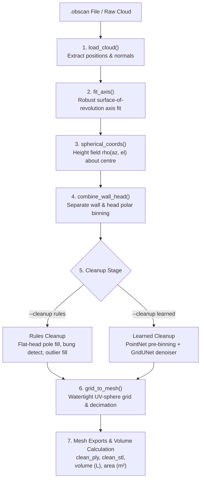

# Barrel Volume & Reconstruction Pipeline Guide

This guide provides a comprehensive, step-by-step walkthrough for running the 3D barrel reconstruction and volume analysis scripts.

---

## 🏗️ Overview & Architecture

The scanner captures internal 3D geometry of wine and spirits barrels. The entry point **`barrel_reconstruct.py`** processes raw `.obscan` scan files (or fused point clouds) into clean, watertight 3D meshes (PLY and STL) and computes key geometrical metrics including internal volume in **Litres**.



---

## ⚙️ 1. Prerequisites & Dependencies

Ensure Python 3.9+ is installed along with the required libraries:

```bash
pip install numpy scipy trimesh
```

If you plan to run or train the **learned cleanup path**, also install PyTorch:

```bash
pip install torch scikit-learn
```

---

## 🚀 2. Single-File Volume & Reconstruction Script (`barrel_reconstruct.py`)

The primary reconstruction tool is **`reconstruction/barrel_reconstruct.py`**.

### Basic Usage

To run reconstruction on an `.obscan` file using default rule-based cleanup:

```bash
python reconstruction/barrel_reconstruct.py "C:/path/to/scan.obscan"
```

To run using the **learned cleanup pipeline** (PointNet pre-filter + GridUNet denoiser):

```bash
python reconstruction/barrel_reconstruct.py --cleanup learned "C:/path/to/scan.obscan"
```

---

### Step-by-Step Instructions: What Happens Under the Hood

When you execute `barrel_reconstruct.py`, it proceeds through the following precise steps:

#### Step 1: Loading Point Cloud (`load_cloud`)
- Connects to SQLite inside `.obscan` (read-only mode).
- Extracts vertex position $(x, y, z)$ and unit normals $(n_x, n_y, n_z)$ from `mesh_vn_0.bat`.

#### Step 2: Fitting Barrel Axis (`fit_axis`)
- Seeds initial axis vector using PCA covariance.
- Refines rotation axis and centre using Powell optimization to minimize within-slice radial Median Absolute Deviation (MAD).

#### Step 3: Spherical Height-Field Mapping (`spherical_coords`)
- Maps points relative to the barrel centre into spherical coordinates:
  - $\text{Azimuth } az \in [-\pi, \pi]$
  - $\text{Elevation } el \in [0, \pi]$ (0 at +axis pole, $\pi$ at −axis pole)
  - $\text{Radius } \rho$ (distance from centre)

#### Step 4: Polar Grid Binning (`make_el_sampling`, `combine_wall_head`)
- Packs dense polar rows around each crozehead corner to sharply capture the crease where stave wall meets the head disc.
- Separately bins wall points ($|n \cdot a| < 0.5$) and head points ($|n \cdot a| \ge 0.5$) so corners do not blur across regions.

#### Step 5: Cleanup & Denoising Mode
- **Rules Mode (`--cleanup rules`)**:
  - `flatten_head_poles()`: Extrapolates missing pole rows using the flat-head secant law $\rho(el) = h / \cos(el)$, preventing central spindle spikes.
  - `detect_bung()`: Identifies the bung patch (>6mm excess, staves only, compact azimuth) and masks it.
  - `fill_grid()` & `smooth_grid()`: Replaces gross outliers and bung cells with row-median wall values and applies light crease-preserving smoothing.
- **Learned Mode (`--cleanup learned`)**:
  - `filter_points_pre_binning()`: Runs PointNet on raw points to filter floater clusters.
  - `learned_clean_grid()`: Runs GridUNet 2D CNN to repair grid NaNs and remove bungs.

#### Step 6: Watertight Mesh Generation (`grid_to_mesh`)
- Converts $\rho(az, el)$ into a watertight 3D triangle mesh.
- Decimates azimuth resolution towards poles to avoid radial pole pinch on head discs.
- Ensures outward face winding for mathematically precise volume calculation.

#### Step 7: Output & Volume Calculation
- Calculates exact internal enclosed volume via signed tetrahedron integration:
  $$\text{Volume} = \frac{1}{6} \sum_{f} \mathbf{v}_0 \cdot (\mathbf{v}_1 \times \mathbf{v}_2)$$
- Writes meshes to configured output subfolders.

---

### Output File Structure

Outputs are written into subdirectories under `OUT_DIR` (default: `C:/raw barrel` or relative to script):

```
OUT_DIR/
├── clean_ply/    <stem>_barrel_clean.ply     (Denoised mesh, bung filled)
├── clean_stl/    <stem>_barrel_clean.stl     (Binary STL for CAD / FEA)
├── axisym_ply/   <stem>_barrel_axisym.ply    (Ideal surface-of-revolution)
└── axisym_stl/   <stem>_barrel_axisym.stl    (Axisymmetric STL)
```

---

## 📦 3. Batch STL Analysis Script (`barrel_batch.py`)

To process a directory of existing barrel STL meshes and extract detailed measurement CSVs:

```bash
python reconstruction/barrel_batch.py "C:/path/to/stl_directory" --out "C:/path/to/output_dir" --pattern "*.stl"
```

### Key Flags
- `--out DIR`: Output directory for combined CSV summaries.
- `--no-clean`: Skip bung removal and clean steps (analyze raw STL).
- `--scale auto|FLOAT`: Auto-detects units (mm vs metres) and scales to metres.

### Batch Outputs
- `measurements_summary.csv`: Wide table containing total volume (L), axial span (mm), bilge radius, crozehead radius per barrel.
- `profiles_combined.csv`: Combined radial profile curves from crozehead to crozehead.
- `per_file/`: Detailed per-barrel logs and measurement CSVs.

---

## 🔬 4. Jupyter Notebook Workflow

For interactive ML model training, tuning, and evaluation, use the notebooks in `notebooks/`:

| Notebook | Purpose |
| --- | --- |
| **`01_synthetic_data.ipynb`** | Generate and inspect 3D synthetic barrels with realistic noise/artifacts. |
| **`02_train_grid_denoiser.ipynb`** | Train and visualize the GridUNet 2D height-field denoiser. |
| **`03_train_point_classifier.ipynb`** | Train the PointNet pre-binning floater/outlier classifier. |
| **`04_evaluate_models.ipynb`** | Side-by-side metric comparison (Rules vs Learned) and fidelity reports. |

---

## ❓ 5. Troubleshooting & FAQ

- **Volume seems inflated or wrong**: Check if `STL_UNITS_MM` in `barrel_reconstruct.py` matches your external tool expectations. Internal computations inside Python are strictly in **metres** and output volume is converted to **Litres** ($1 \text{ m}^3 = 1000 \text{ L}$).
- **Central spike/spindle on the head**: The rule-based `flatten_head_poles()` prevents this by using flat-head secant law. Make sure `--no-despindle` was not passed in batch mode.
- **Learned cleanup fallback**: If PyTorch model checkpoints (`models/*.pt`) are missing when running `--cleanup learned`, the script will print a warning and safely fall back to `--cleanup rules`.
