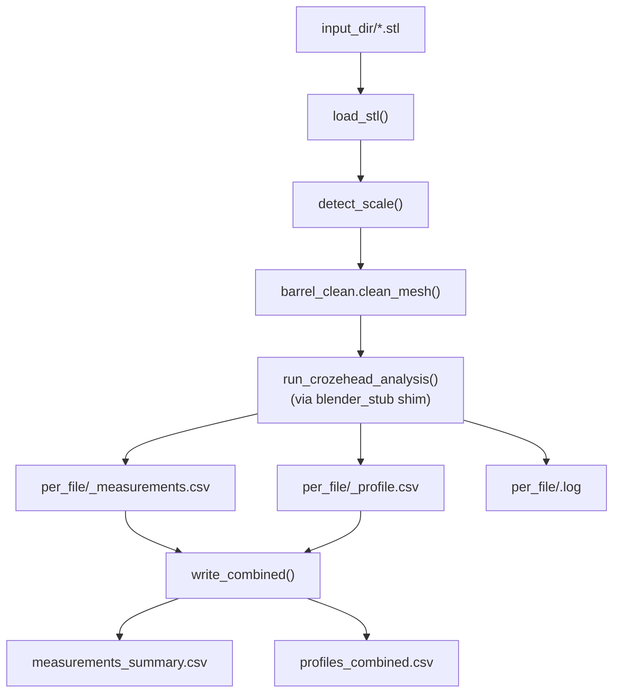

# Pipeline Guide

This guide is the practical, copy-paste walkthrough for running the barrel reconstruction pipeline from a single .obscan scan or from a directory of STL meshes.

The high-level flow is:



## 1. Prerequisites

- Python 3.9 or newer
- Install the packages imported by the current reconstruction entry points:

```bash
pip install numpy scipy trimesh
```

If you want to exercise the learned cleanup path and the training scripts, also install:

```bash
pip install torch scikit-learn
```

## 2. Single-file reconstruction

The single-file entry point is [barrel_reconstruct.py](../barrel_reconstruct.py). The current command-line shape is:

```bash
python barrel_reconstruct.py --cleanup rules "C:/raw barrel/resources.obscan"
```

### What the current flags do

- `--cleanup rules` (default) uses the production rule-based cleanup path.
- `--cleanup learned` switches to the learned cleanup path when the model checkpoints are available; the script will fall back to rules if the learned stage cannot run.
- The positional argument is one or more .obscan files to reconstruct. If you omit it, the script falls back to the default output directory and looks for .obscan files there.

### What gets written

The reconstruction scripts write output variants into the output folders under the hard-coded output root (the script defaults to `C:/raw barrel` unless you change it in code). The current writer creates these folders:

- clean_ply/ — clean PLY meshes
- axisym_ply/ — axisymmetric PLY meshes
- clean_stl/ — clean STL meshes
- axisym_stl/ — axisymmetric STL meshes

Each output file is named like:

- `<stem>_barrel_clean.ply`
- `<stem>_barrel_axisym.ply`
- `<stem>_barrel_clean.stl`
- `<stem>_barrel_axisym.stl`

## 3. Batch processing

The batch entry point is [barrel_batch.py](../barrel_batch.py). A typical run is:

```bash
python barrel_batch.py "C:/path/to/stl_dir" --out "C:/path/to/barrel_output" --pattern "*.stl" --max-passes 3 --overlap auto --scale auto --verbose
```

### Batch flags

- `--out DIR` — output directory for the combined CSVs and per-file subfolder.
- `--pattern GLOB` — glob used to find input STL files.
- `--max-passes N` — maximum bung detect/remove/fill passes during cleanup.
- `--no-clean` — skip cleanup and analyse the raw mesh.
- `--no-despindle` — do not remove the artificial central spike at each head.
- `--overlap auto|on|off` — whether to run internal overlap-face removal; `auto` skips it for large meshes above the `--overlap-max-faces` threshold.
- `--overlap-max-faces N` — face-count threshold used by `--overlap auto`.
- `--scale auto|FLOAT` — rescale mesh extent to metre scale; `auto` uses the nearest power-of-ten factor, while `1` disables rescaling.
- `--verbose` — echo full per-file pipeline output to the terminal.
- `--rebuild-only` — skip analysis and rebuild the combined outputs from existing per-file CSVs.

### What the batch outputs contain

The batch run writes:

- `measurements_summary.csv` — one row per input STL, with one wide column per measurement parameter.
- `profiles_combined.csv` — one row per profile sample from each barrel, with a `source_file` column.
- `per_file/` — one subfolder per processed file containing:
  - `<name>_measurements.csv`
  - `<name>_profile.csv`
  - `<name>.log`

## 4. Reading the outputs

The batch wrapper does not invent a new schema; it preserves the measurement columns emitted by the underlying Blender analysis step. The most common columns are:

| Column family | Meaning |
| --- | --- |
| axial span | axial length of the barrel from one crozebevel to the other. |
| crozehead radius | radius at the crozehead/crozebevel corner where wall meets head. |
| bilge radius | widest mid-span radius of the barrel body. |
| crozebevel radius | radius at the crozebevel edge. |
| head radius | radius of the flat head disc. |
| volume | enclosed internal volume of the reconstructed barrel. |
| sub-volume columns | any additional partitioned volume metrics emitted by the analysis step; these are carried through as extra columns in the summary CSV. |

The same measurements are also written into the per-file CSVs under the per_file directory.

## 5. Choosing rules vs. learned cleanup

The current default is rule-based cleanup. It is the production path and is implemented directly in [barrel_reconstruct.py](../barrel_reconstruct.py).

### Rules mode

Use `--cleanup rules` when you want the most reliable, interpretable cleanup path. The rule-based pipeline explicitly preserves the crease/crozehead split and is robust on the crozehead region because it uses the wall/head split and corner-row packing.

### Learned mode

Use `--cleanup learned` when you want to try the newer learned path. The learned path is intended to improve robustness around the pole/head region and reduce the kind of cell-level corruption that can leak through the rule-based outlier handling. In the current repository it relies on the point-level classifier and grid denoiser modules, and it will fall back to rules if those components are unavailable or fail.

### Side-by-side comparison

Once the learned models are wired into the evaluation path, the intended comparison command is:

```bash
python barrel_eval.py --compare "C:/path/to/scan.obscan"
```

The current repository still uses the synthetic evaluation path as the ready-to-run baseline, so the practical comparison workflow is to run the rules and learned variants separately and compare the reported metrics.

## 6. Training the learned models

The training workflow is driven by the synthetic generator and the learned model scripts.

### Generate synthetic data

```bash
python barrel_synth.py --test
python barrel_synth.py --dump synthetic_barrel.npz
```

The first command produces a quick self-check; the second writes a compressed `.npz` dataset that can be reused by the training scripts.

### Train the grid denoiser

```bash
python train_grid_denoiser.py --epochs 15 --batch-size 4
```

### Train the point classifier

```bash
python train_point_classifier.py --epochs 10
```

### Evaluate the metrics

```bash
python barrel_eval.py --synthetic --seed 42
```

The summary output reports:

- `fidelity_rms_mm` — overall point-to-surface residual in millimetres.
- `crozehead_rms_mm` — residual near the crozehead crease band.
- `head_pole_rms_mm` — residual near the head/pole rows.
- `asym_rms_mm` — departure from an ideal surface of revolution.
- `gt_rms_mm` — synthetic-only RMS error versus the analytic ground-truth grid.

## 7. Troubleshooting

This repository does not currently ship a checked-in sample log bundle with the warning phrases from the original workflow notes, so the most actionable messages to watch are the ones emitted directly by the current scripts.

- `PointNet pre-binning filter skipped: ...` or `GridUNet fallback to rules due to error: ...` — the learned path failed. This is usually benign if you are just testing the fallback path, but it is worth investigating if you expected the learned path to run and the model checkpoint is present.
- `No files matching ...` from the batch runner — the input directory did not contain any files matching the provided glob. Check the path and `--pattern` value.
- `--overlap auto` skipping overlap removal — expected on very large meshes above the configured face-count threshold. It is usually benign, but worth investigating if the mesh looks incorrectly self-intersecting or if the analysis output is unexpectedly poor.
- If the Blender-side analysis emits warnings such as “head not found” or “mid-span exceeds bilge”, treat them as geometry-analysis warnings rather than fatal errors. They are usually a sign that the scan fit is ambiguous or the barrel shape is outside the expected range, so investigate them if they recur on many files or if the reconstructed mesh is obviously wrong.
